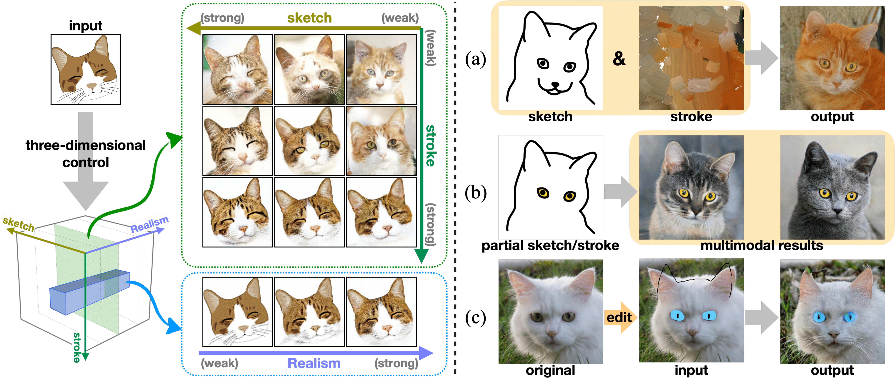
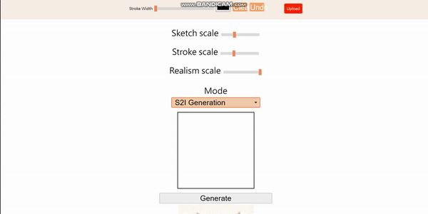

# DiSS (WACV 2023)
PyTorch implementaton of our WACV 2023 paper "Adaptively-Realistic Image Generation from Stroke and Sketch with Diffusion Model". You can visit our project website [here](https://cyj407.github.io/DiSS/).

In this paper, we propose a unified framework supporting a three-dimensional control over the image synthesis from sketches and strokes based on diffusion models.



## Paper
[Adaptively-Realistic Image Generation from Stroke and Sketch with Diffusion Model](https://arxiv.org/abs/2208.12675) \
[Shin-I Cheng*](shinicheng.cs09g@nctu.edu.tw), [Yu-Jie Chen*](cyj407.cs09g@nctu.edu.tw), [Wei-Chen Chiu](walon@cs.nctu.edu.tw), [Hung-Yu Tseng](hungyutseng@fb.com), [Hsin-Ying Lee](hlee5@snap.com) \
Winter Conference on Applications of Computer Vision (WACV), 2023 (* equal contribution)

Please cite our paper if you find it useful for your research.  
```
@inproceedings{cheng2023wacv,
 title = {Adaptively-Realistic Image Generation from Stroke and Sketch with Diffusion Model},
 author = {Shin-I Cheng and Yu-Jie Chen and Wei-Chen Chiu and Hung-Yu Tseng and Hsin-Ying Lee},
 booktitle = {IEEE Winter Conference on Applications of Computer Vision (WACV)},
 year = {2023}
}
```

## Installation and Environment
- Prerequisities: Python 3.6 & Pytorch (at least 1.4.0) 
- Clone this repo
```
git clone https://github.com/cyj407/DiSS.git
cd DiSS
```

- We provide a conda environment script, please run the following command after cloning our repo.
```
conda env create -f diss_env.yaml
```
## Datasets
- AFHQ (cat, dog, wildlife) You can follow the instructions in StarGAN v2 [website](https://github.com/clovaai/stargan-v2) to download the AFHQ (cat, dog, wildlife) dataset.
- Flowers You can follow the instructions in the [website](https://www.robots.ox.ac.uk/~vgg/data/flowers/) to download the flower dataset.
- Landscapes (LHQ) You can follow the instructions in ALIS [website](https://github.com/universome/alis) to download the LHQ1024 dataset.
## User-Friendly Interface


- To draw a sketch/stroke images on the interface or upload a reference input image, run the following command and access [http://127.0.0.1:5000](http://127.0.0.1:5000). First loading would need more time.
```
python app.py
```
- The corresponding output image will be computed for about 55 seconds.
## Train
#### Preparing sketch and stroke data
- We utilize [Photo-Sketching: Inferring Contour Drawings from Images](https://github.com/mtli/PhotoSketch) for sketach generation and [Stylized Neural Painting](https://github.com/jiupinjia/stylized-neural-painting), [Paint Transformer: Feed Forward Neural Painting with Stroke Prediction](https://github.com/Huage001/PaintTransformer) for stroke generation, please refer to our paper for details. 
- Please organize the whole dataset as follow:
```
Root Dir/
  -<dataset_path>/
    -Image1
    -Image2
    -...
  -"<dataset_path>_sketch"/
    -Image1
    -Image2
    -...
  -"<dataset_path>_stroke"/
    -Image1
    -Image2
    -...
```
#### Training your own models
- We use the following hyperparameters among the three datasets in our paper, you can design your own ones.
```
MODEL_FLAGS="--attention_resolutions 32,16,8 --image_size 512 --num_channels 128 --num_res_blocks 3 --use_scale_shift_norm True"
DIFFUSION_FLAGS="--diffusion_steps 1000 --noise_schedule linear" 
TRAIN_FLAGS="--lr 1e-4 --batch_size 2"
```
- Train your own sketch and stroke conditioned diffusion models with desired data stored in <dataset_path>.
```
python train.py --data_dir <dataset_path> --path <path_for_saving_the_models> $MODEL_FLAGS $DIFFUSION_FLAGS $TRAIN_FLAGS 
```
- Finetune the trained models (stored at <pretrained_model_path>) for sketch and stroke classifier-free guidance (randomly replacing 30% of each condition with an image filled with gray pixels).
```
python finetune.py --data_dir <dataset_path> --path <path_for_saving_the_models> --trained_model <pretrained_model_path> $MODEL_FLAGS $DIFFUSION_FLAGS $TRAIN_FLAGS 
```
## Test
#### Using the pre-trained models
- Download the [pre-trained diffusion models](https://mega.nz/file/EakHmYSC#Kz6b36NkWLgIG-kKVTSt8jRg228or3FtVpr_cqO1szM), here we provide the pre-trained diffusion model for the AFHQ-cat, Flowers, LHQ and AFHQ(cats, dogs, and wildlife) dataset.
- Unzip the downloaded file, and save all the model under the path `./checkpoints/`.
### Adaptively Sketch-to-Image Generation
- Flowers
```
MODEL_FLAGS="--attention_resolutions 32,16,8 --image_size 512 --num_channels 128 --num_res_blocks 3 --use_scale_shift_norm True"
DIFFUSION_FLAGS="--diffusion_steps 1000 --noise_schedule linear"
python sample.py $MODEL_FLAGS $DIFFUSION_FLAGS --timestep_respacing 250 --model_path "./checkpoints/flower512.pt" --lhq False --input_image "./test-examples/realism-example.png"
```
- Landscapes
```
MODEL_FLAGS="--attention_resolutions 32,16,8 --image_size 512 --num_channels 128 --num_res_blocks 3 --use_scale_shift_norm True"
DIFFUSION_FLAGS="--diffusion_steps 1000 --noise_schedule linear"
python sample.py $MODEL_FLAGS $DIFFUSION_FLAGS --timestep_respacing 250 --model_path "./checkpoints/lhq512.pt" --lhq True --input_image "./test-examples/realism-example2.png"
```
### Multi-conditioned Local Editing
```
MODEL_FLAGS="--attention_resolutions 32,16,8 --image_size 512 --num_channels 128 --num_res_blocks 3 --use_scale_shift_norm True"
DIFFUSION_FLAGS="--diffusion_steps 1000 --noise_schedule linear"
CUDA_VISIBLE_DEVICES=1, python local-editing.py $MODEL_FLAGS $DIFFUSION_FLAGS --timestep_respacing 250
```
### Region-sensitive Stroke-to-Image
```
MODEL_FLAGS="--attention_resolutions 32,16,8 --image_size 512 --num_channels 128 --num_res_blocks 3 --use_scale_shift_norm True"
DIFFUSION_FLAGS="--diffusion_steps 1000 --noise_schedule linear"
CUDA_VISIBLE_DEVICES=0, python partial-editing.py $MODEL_FLAGS $DIFFUSION_FLAGS --timestep_respacing 250
```
### Multimodal Output (Given 1 stroke image guided with different sketches.)
```
MODEL_FLAGS="--attention_resolutions 32,16,8 --image_size 512 --num_channels 128 --num_res_blocks 3 --use_scale_shift_norm True"
DIFFUSION_FLAGS="--diffusion_steps 1000 --noise_schedule linear"
python multimodal.py $MODEL_FLAGS $DIFFUSION_FLAGS --timestep_respacing 250
```
## Acknowledgments
Our code is based on [guided-diffusion](https://github.com/openai/guided-diffusion) and [pytorch-resizer](https://github.com/assafshocher/ResizeRight).
The inference code of the user interface is borrowed from [blended-diffusion](https://github.com/omriav/blended-diffusion).